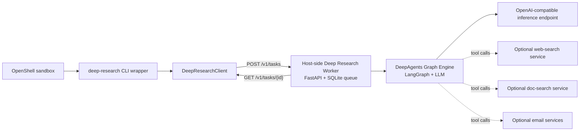
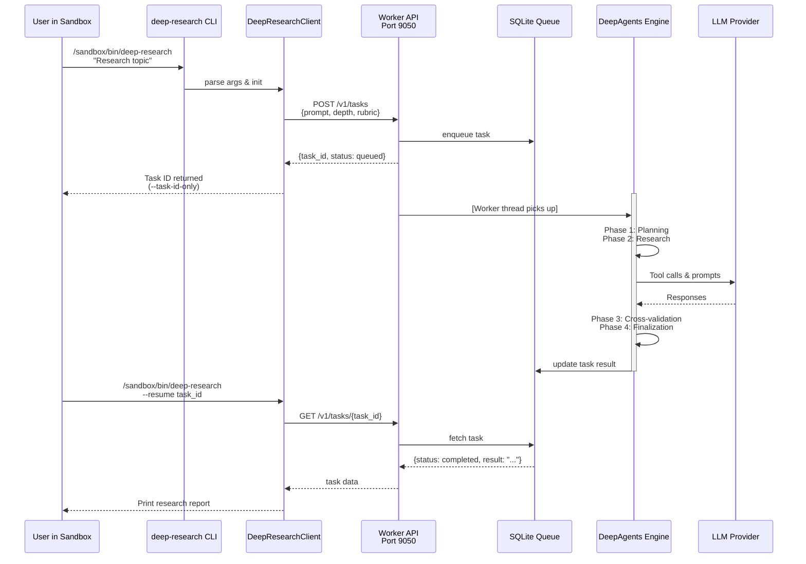
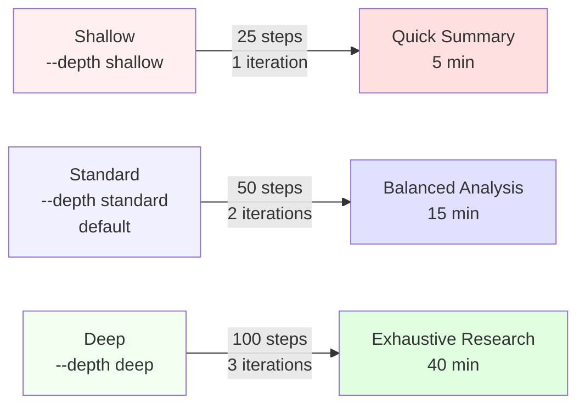
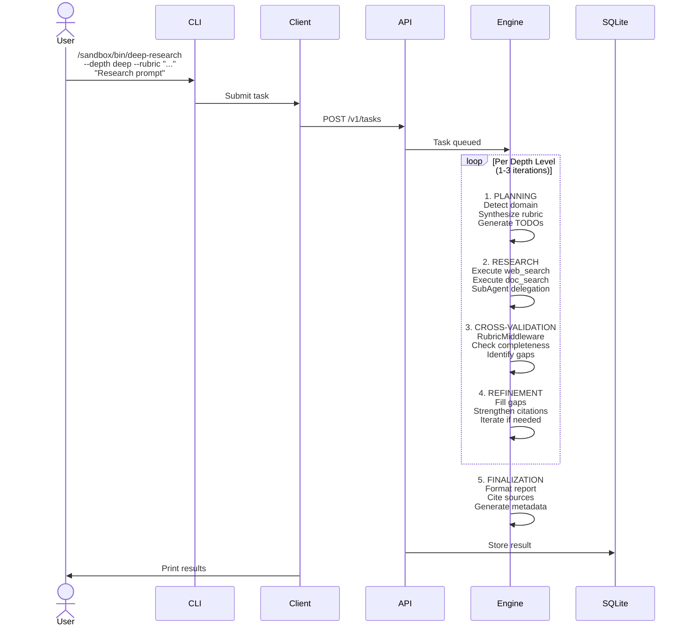
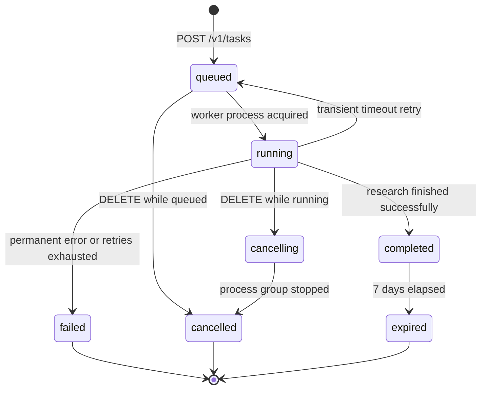
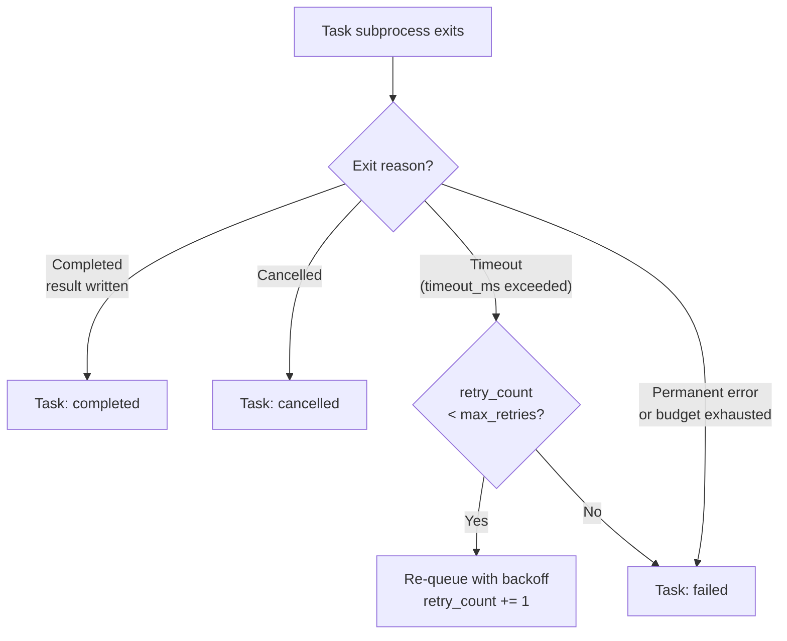
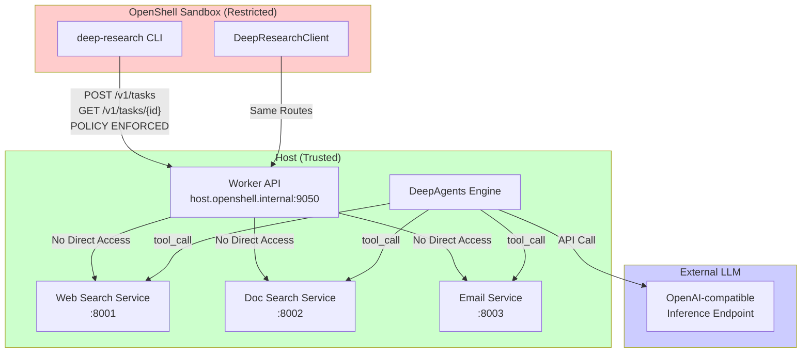

<!-- SPDX-FileCopyrightText: Copyright (c) 2026 NVIDIA CORPORATION & AFFILIATES. All rights reserved. -->
<!-- SPDX-License-Identifier: Apache-2.0 -->

# Deep Research Worker

Deep Research Worker is a community recipe for asynchronous, long-horizon
research with a NemoClaw-managed sandbox. It installs a `deep-research` skill
and CLI wrapper into one existing sandbox, then routes requests from that
sandbox to a host-side FastAPI worker that runs a LangChain DeepAgents graph,
stores task state in SQLite, and can call bounded host-side helper services.

This example is based on the public proposal in issue `#110`. It is an
independent community contribution, not a supported part of NemoClaw core. Its
catalog placement supports discovery only; it does not imply NVIDIA support or
a support or readiness guarantee.

## Scope

This recipe stands up the host-side research worker, installs the in-sandbox
skill and CLI wrapper, and adds or applies a narrow policy that lets a
dedicated sandbox reach only that worker on `host.openshell.internal:9050`.

It does not:

- create a sandbox for you
- provision an inference provider
- stand up web-search, doc-search, or email helper services
- start a dashboard or a general-purpose OpenClaw agent runtime
- manage unrelated routes on a shared sandbox safely

Use a dedicated sandbox for this recipe. The worker can call helper services on
the same host when you configure their endpoints.

## Provenance And Intended Users

- Provenance: independent community contribution proposed in public issue `#110`
- Intended users: operators who already run NemoClaw or OpenShell and want to
  add a background research workflow to one sandbox
- Support boundary: this repository example documents one public integration
  pattern; operators remain responsible for provider credentials, host service
  availability, and any production hardening

## Requirements

- Docker with Compose support
- Python 3.10 or newer for local syntax checks
- One working OpenShell or NemoClaw host with a dedicated sandbox for this recipe
- One OpenAI-compatible inference endpoint reachable from the worker container

Optional host-side services:

- web search on `WEBSEARCH_ENDPOINT_URL`
- document search on `DOC_SEARCH_ENDPOINT_URL`
- outbound email on `MAILING_SERVICE_URL`
- inbound email search on `EMAIL_ACTION_SERVICE_URL`

## Credentials And Secret Handling

Copy `.env.example` to `.env` and replace placeholder values before live use.

Required values:

- `OPENAI_API_KEY`
- any non-default endpoint overrides your host requires

Recommended values:

- `DEEPAGENTS_SERVICE_SECRET` so the worker API is not left unauthenticated on
  a shared host

Do not commit `.env`, generated state, or sandbox-local token material. The
local `.gitignore` excludes `.env`, `state/`, and `.run/`.

## Quickstart

```bash
git clone https://github.com/NVIDIA/nemoclaw-community.git
cd nemoclaw-community/examples/recipes/community/deep-research-worker

cp .env.example .env
bash scripts/bring-up.sh
```

Queue a task from inside the target sandbox:

```bash
openshell sandbox exec --name deep-research-worker -- \
  /sandbox/bin/deep-research --depth deep \
  "Compare public agent sandboxing patterns for long-running research workflows"
```

Stop the worker and remove the installed skill assets:

```bash
bash scripts/teardown.sh
```

## Architecture

### High-Level Component Flow



### Request/Response Lifecycle



### Component Responsibilities

**Sandbox Components:**
- `deep-research` CLI wrapper: User-facing command with depth presets and custom rubric options
- `DeepResearchClient`: Handles API communication, polling, output formatting, task history

**Host-Side Worker:**
- `FastAPI service` on port 9050: HTTP API for task submission, status polling, and retrieval
- `SQLite task store`: Persistent queue with retry logic, exponential backoff, and 7-day retention
- `DeepAgents graph engine`: LangGraph-based agentic loop for multi-step research
- `Circuit breaker`: Fault tolerance for tool timeouts and transient errors

### Key Boundaries

1. **Network isolation**: The sandbox can reach **only** the worker API on `host.openshell.internal:9050`, not helper services directly.
2. **Task persistence**: The worker stores task queue, state, and results in SQLite on the host; sandbox cannot access the database.
3. **Credential isolation**: Helper service endpoints and secrets are configured only on the host; the sandbox never sees them.
4. **Concurrency**: Up to 5 worker threads run research tasks in parallel; concurrent requests are queued.
5. **Process isolation**: Each task runs in a dedicated process group that the parent fully stops before a cancellation or timeout changes task state.

## Files

| Path | Purpose |
| --- | --- |
| `docker-compose.yml` | Runs the host-side worker container |
| `policies/deep-research-worker.yaml` | Narrow sandbox egress policy for the worker API |
| `scripts/bring-up.sh` | Starts the worker, applies the policy, installs the skill and CLI wrapper |
| `scripts/verify.sh` | Teardown-safe local checks for shell syntax, Python syntax, Compose rendering, and skill metadata |
| `scripts/teardown.sh` | Stops the worker and removes the installed skill assets |
| `src/` | Worker service, task store, client, and container build files |

## DeepAgents Design And Execution Model

The research worker runs a **LangGraph-based agentic loop** that implements multi-step research with quality-driven refinement.

### Execution Depth Presets

| Depth | Graph Steps | Rubric Iterations | Max Duration | Use Case |
| --- | --- | --- | --- | --- |
| `shallow` | 25 | 1 | 5 min | Quick summaries, fact-checking single topics |
| `standard` | 50 | 2 | 15 min | Competitive analysis, multi-source research (default) |
| `deep` | 100 | 3 | 40 min | Whitepapers, comprehensive reviews, cross-domain synthesis |



### Agentic Loop Phases



**Phase Details:**

1. **Planning**: Agent synthesizes domain-adaptive TODOs and quality rubric
   - Automatically detects domain (legal, finance, tech, etc.) from the research goal
   - Generates discipline-specific quality criteria (e.g., "include statutory citations" for legal, "asset allocation tables" for finance)
   - Defines evaluation checkpoints based on depth level

2. **Research and Refinement**: Agent iterates through research steps
   - Executes web search, document lookup, and other tool calls
   - Delegates subtopics to isolated `SubAgent` workers to prevent context window saturation
   - Synthesizes partial findings and identifies knowledge gaps

3. **Cross-Validation (RubricMiddleware)**: Quality gates enforce completeness
   - Evaluates output against the synthesized or custom rubric
   - Identifies missing sections, weak citations, or incomplete analyses
   - Triggers refinement loops if quality criteria are not met (up to N iterations per depth level)

4. **Finalization**: Formats and delivers the completed research report
   - Structures output with sections, summaries, source citations
   - Returns task completion with full text and metadata

### Custom Rubrics

Users can override the auto-synthesized rubric with `--rubric "<criteria>"`:

```bash
/sandbox/bin/deep-research --depth deep --rubric \
  "Must include: (1) asset allocation tables, (2) tax drag calculations, (3) SEC compliance notes" \
  "Analyze portfolio rebalancing strategy for high-net-worth tech employee"
```

The rubric becomes a hard constraint; the agent will iterate until all criteria are satisfied or the graph step budget is exhausted.

### Tool Integration And Safety

The worker can call bounded helper services:
- **Web search**: Returns top results with relevance scoring
- **Document search**: Searches indexed internal documents (e.g., prior research, legal templates)
- **Email tools**: Send task results or fetch email summaries (when configured)

A **circuit breaker** prevents cascading failures:
- Transient errors (429, 5xx, timeouts) trigger exponential backoff and retry
- Tool failures do not block the graph; the agent pivots to alternative research strategies
- Permanent errors (400, 403) fail fast

## Usage Examples

### Example 1: Quick Summary (Shallow Depth)

```bash
openshell sandbox exec --name deep-research-worker -- \
  /sandbox/bin/deep-research --depth shallow \
  "Summarize the latest NIST cybersecurity framework updates"
```

Expected time: ~5 minutes. Returns a concise summary with key points and sources.

### Example 2: Competitive Analysis (Standard Depth)

```bash
openshell sandbox exec --name deep-research-worker -- \
  /sandbox/bin/deep-research \
  "Compare vector database performance: Pinecone vs. Weaviate vs. Milvus in 2026"
```

Expected time: ~15 minutes. Returns structured comparison with benchmarks, feature matrices, and cost analysis.

### Example 3: Deep Exhaustive Research with Custom Rubric

```bash
openshell sandbox exec --name deep-research-worker -- \
  /sandbox/bin/deep-research --depth deep \
  --rubric "Must cover: (1) regulatory landscape, (2) technical implementation patterns, (3) case studies, (4) risk assessment" \
  "Research 5 levels of agentic workflow platform security and draft a technical whitepaper"
```

Expected time: ~40 minutes. The agent will iterate until all rubric criteria are satisfied.

### Example 4: Portfolio Rebalancing Analysis (Domain-Adaptive Rubric)

```bash
openshell sandbox exec --name deep-research-worker -- \
  /sandbox/bin/deep-research --depth deep \
  "Analyze portfolio rebalancing strategy for high-net-worth tech employee with concentrated stock positions"
```

Output includes asset allocation tables, tax drag calculations, and regulatory considerations (auto-generated).

### Example 5: Asynchronous Task Submission and Polling

```bash
openshell sandbox exec --name deep-research-worker -- \
  /sandbox/bin/deep-research --depth deep --task-id-only \
  "Research emerging LLM safety frameworks and draft security assessment"
```

Output: `task_id = f7e2a1b3c9d4e5f6`

Later, retrieve results:

```bash
openshell sandbox exec --name deep-research-worker -- \
  /sandbox/bin/deep-research --resume f7e2a1b3c9d4e5f6
```

Or list recent tasks:

```bash
openshell sandbox exec --name deep-research-worker -- \
  /sandbox/bin/deep-research --list 5
```

### Example 6: Export Results to JSON

```bash
openshell sandbox exec --name deep-research-worker -- \
  /sandbox/bin/deep-research --json --output /tmp/research.json \
  "Compare open-source model serving frameworks"
```

The JSON output includes task_id, status, full research text, metadata (depth, execution time, step count), and sources with confidence scores.

## Task Lifecycle And State Management

### Task States

A research task progresses through the following states:

| State | Meaning |
| --- | --- |
| `queued` | Task received, waiting for a worker thread |
| `running` | DeepAgents graph is executing research steps |
| `cancelling` | DELETE received; process group is being stopped |
| `cancelled` | Task stopped by caller request |
| `completed` | Research finished successfully; results are ready |
| `failed` | Task failed; error message available |
| `expired` | Task results deleted after 7-day TTL |

### Task State Transitions



### Retry Behavior

Task-level retries occur only when the worker process exceeds its execution
timeout (`timeout_ms`). All other failure modes are permanent and go directly
to `failed`:

- **Task timeout** (`timeout_ms` exceeded): Re-queued with exponential backoff
  (`2^retry_count` seconds, capped at 60 s). Default max retries: **2**
  (configurable per task via `max_retries`).
- **Permanent errors** (import failures, graph recursion limit, auth errors,
  unhandled exceptions): Fail immediately; no retry.
- **Budget exhaustion** (tool-call budget reached mid-task): Permanent failure;
  no retry.
- **Cancelled tasks**: Never retried.

Tool-call retries (inside a single task execution) are a separate concern:
transient HTTP errors (429, 5xx, network timeout) are retried up to 2 times
with exponential backoff before the tool returns a structured error token to
the agent. Tool-call retries do not affect task-level retry counts.



## Setup And Configuration

`scripts/bring-up.sh` does four things:

1. Loads `.env` when present.
2. Starts or rebuilds the worker with Docker Compose.
3. Waits for `GET /healthz` on the worker.
4. If `openshell` and the named sandbox exist, installs the policy and then installs:
   - `SKILL.md` into `/sandbox/.openclaw/skills/deep-research/`
   - `deep_research_client.py` into the same skill directory
   - a mode-`0600` worker credential into the same skill directory
   - `/sandbox/bin/deep-research` as the user-facing wrapper

Policy behavior:

- If `nemoclaw` is available, the script adds the recipe policy additively with
  `policy-add --from-file`.
- If only `openshell` is available, the script refuses to replace the full
  sandbox policy unless you set `DEEP_RESEARCH_ALLOW_POLICY_REPLACE=1` for a
  dedicated sandbox.

The script does not create a sandbox. If the sandbox is missing, it leaves the
host-side worker running and prints the follow-up action.

## Network And Policy Permissions

The sandbox policy is intentionally narrow. It allows only:

- `host.openshell.internal:9050`
- REST methods `GET`, `POST`, and `DELETE`
- binaries that invoke the wrapper or Python client

The sandbox does not receive direct routes to host-side web search, doc search, or other helper services. Only the worker container can call configured services.

### Network Isolation Model



The host port binds to the `openshell-docker` bridge address when that network is available and otherwise binds to `127.0.0.1`. It is never intentionally published on every host interface.

Inside the worker container, helper-service defaults use `host.docker.internal`. The Compose file adds an explicit host-gateway mapping so Linux Docker hosts can resolve that name too.

The protected credential file authorizes the selected sandbox to call the worker. Code running as that sandbox user can use the credential, so install this recipe only into a dedicated sandbox whose policy and workloads you trust.

## Execution And Recovery

The queue uses these lifecycle rules:

- Each claimed task runs in an isolated child process.
- Cancellation, timeout, shutdown, and task completion terminate the entire
  process group, including descendants, before the task changes state.
- On service restart, abandoned `running` tasks become failed and abandoned
  `cancelling` tasks become cancelled. They are not replayed automatically.
- Retention cleanup removes only expired terminal tasks.

## Verification

Run the documented lightweight checks from this example directory:

```bash
bash scripts/verify.sh
```

The script is teardown-safe. It does not start external services or contact the
inference provider. It validates:

- shell syntax for `scripts/*.sh`
- Python syntax for `src/*.py`
- behavioral tests for authentication, rubric revision, tool filtering,
  cancellation, timeout, restart recovery, and retention cleanup
- Docker Compose rendering
- skill frontmatter presence
- policy file shape

Expected result:

```text
PASS: deep-research-worker local verification
```

## Output Formats And Result Handling

### Default Output Format (Plain Text)

By default, the client prints the task `result` field from the server response
directly to stdout. The format of that text is determined by the agent's
output; no wrapper or header is added by the client:

```
## Executive Summary
[Agent-generated summary paragraph]

## Key Findings
- Finding 1
- Finding 2

## Detailed Analysis
[Full technical analysis]

## Sources
- https://example.com/doc1
- https://example.com/doc2
```

### JSON Output Format

Use `--json` to write a structured envelope to stdout (or `--output <path>` to
write to a file instead). The client emits exactly these six fields:

```bash
openshell sandbox exec --name deep-research-worker -- \
  /sandbox/bin/deep-research --json --output /tmp/result.json \
  "Research AI safety frameworks"
```

```json
{
  "task_id": "f7e2a1b3c9d4e5f6",
  "status": "completed",
  "depth": "standard",
  "result": "<agent-generated markdown>",
  "duration_seconds": 743,
  "retry_count": 0
}
```

No additional metadata fields (graph steps, rubric iterations, sources, or
timestamps) are included in the client output. Those fields are available on
the raw task object returned by `GET /v1/tasks/{task_id}` if you need them.

### Handling Large Results

For very long research outputs:

1. **Write to a file with `--output`**: Redirects stdout to a file instead of
   the terminal.
2. **Use `--json` for programmatic parsing**: Wraps the result in the six-field
   envelope above so downstream tools can parse `result` as a string.
3. **Fetch raw task data**: Call `GET /v1/tasks/{task_id}` directly from a
   host-side script to access the full stored task record, which includes
   timestamps and other internal fields.

## Known Limitations

- The included verification does not contact the configured inference endpoint
  or prove that helper services and sandbox policy work live.
- The worker depends on third-party packages and live host-side services. The
  DeepAgents version is pinned for the tested rubric API, but the example does
  not include a complete transitive lockfile.
- There are two distinct timeout settings. `--timeout <seconds>` (or the
  depth-based default: shallow=300 s, standard=900 s, deep=2400 s) controls
  how long the **client** polls before printing a resume hint and exiting.
  `timeout_ms` in the API body (default 600 000 ms, env
  `DEEPAGENTS_TASK_TIMEOUT_MS`) controls how long the **server-side task
  process** runs before it is killed and the task is retried or failed. A
  client polling timeout does not stop the server task.
- Operators who use `openshell policy set` without a dedicated sandbox can
  replace unrelated policy rules; the script blocks that path unless
  `DEEP_RESEARCH_ALLOW_POLICY_REPLACE=1` is set explicitly.

## Third-Party Dependencies And License Notes

The worker container installs Python packages listed in `src/requirements.txt`
and uses the `python:3.11-slim` base image. The repository-level
`THIRD-PARTY-NOTICES` file records the expected notice inventory for those
components. Review the terms of any external search or inference service before
production use.
